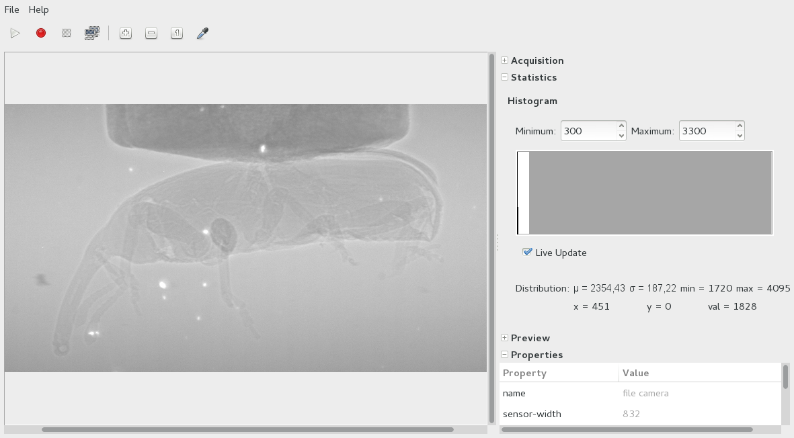

Tools
=====

Several tools are available to ensure ``libuca`` works as expected. All
of them are installed with ``make install``.

uca-camera-control -- simple graphical user interface
-----------------------------------------------------

Records and shows frames. Moreover, you can change the camera properties in a
side pane:

You can see all available options of ``uca-camera-control`` with::

    $ uca-camera-control --help-all

uca-grab -- grabbing frames
---------------------------

Grab frames with ::

    $ uca-grab --num-frames=10 camera-model

store them on disk as ``frames.tif`` if ``libtiff`` is installed,
otherwise as ``frame-00000.raw``, ``frame-000001.raw``. The raw format
is a memory dump of the frames, so you might want to use
`ImageJ <http://rsbweb.nih.gov/ij/>`__ to view them. You can also
specify the output filename or filename prefix with the ``-o/--output``
option::

    $ uca-grab -n 10 --output=foobar.tif camera-model

Instead of reading exactly *n* frames, you can also specify a duration
in fractions of seconds::

    $ uca-grab --duration=0.25 camera-model

You can see all available options of ``uca-grab`` with::

    $ uca-grab --help-all

uca-benchmark -- check bandwidth
--------------------------------

Measure the memory bandwidth by taking subsequent frames and averaging
the grabbing time::

    $ uca-benchmark option camera-model

You can specify the number of frames per run with the ``-n/--num-frames`` option, the number of runs with the ``-r/--num-runs`` option and test asynchronous mode with the ``async`` option::

    $ uca-benchmark -n 100 -r 3 --async mock

    # Type    Trigger Source   FPS        Bandwidth   Frames acquired/total
      sync    auto             17.57 Hz   4.39 MB/s   300/300 acquired (0.00% dropped)
      async   auto             19.98 Hz   4.99 MB/s   300/300 acquired (0.00% dropped)

    # --- General information ---
    # Camera: mock
    # Sensor size: 4096x4096
    # ROI size: 512x512
    # Exposure time: 0.050000s

You can see all available options of ``uca-benchmark`` with::

    $ uca-benchmark --help-all

uca-info -- get properties information
--------------------------------------

Get information about camera properties with::

    $ uca-info camera-model

For example::

    $ uca-info mock
    # RO | name                      | "mock camera"
    # RO | sensor-width              | 4096
    # RO | sensor-height             | 4096
    # RO | sensor-pixel-width        | 0.000010
    # RO | sensor-pixel-height       | 0.000010
    # RO | sensor-bitdepth           | 8
    ...

uca-gen-doc -- generate properties documentation
------------------------------------------------

Generate HTML source code of property documentation of a camera with::

    $ uca-gen-doc camera-model
